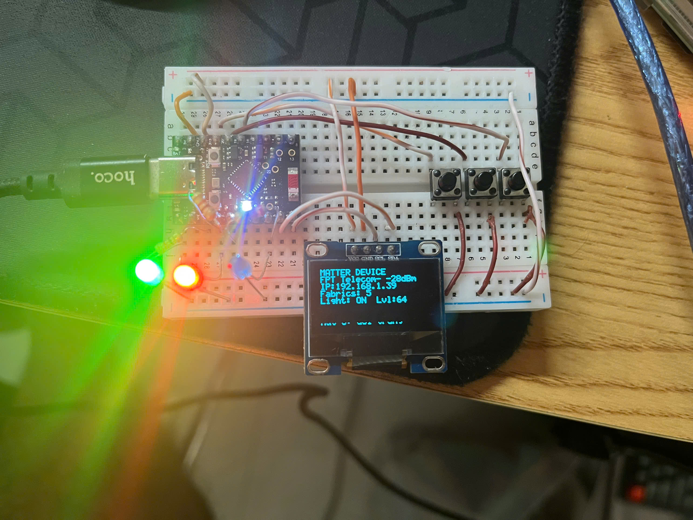

# Matter over Wi-Fi smart light — multi-admin capstone

An ESP32-C6 Matter end device that five independent controllers drive at the same time.

The interesting part of Matter is not that a phone can switch a lamp on. It is *multi-admin*:
one device joins several fabrics at once, each with its own certificates and its own owner, and
every controller sees the same state. Commercial hubs hide that behind a pairing wizard. This
project builds the device, joins it to Home Assistant and to four separate `chip-tool`
controllers, and measures what actually happens — including where the device runs out of room.



## What it does

The node exposes two endpoints and a local status display:

| | |
|---|---|
| **Endpoint 1** | Extended Color Light — on/off, level, colour (XY), driving the onboard WS2812 |
| **Endpoint 2** | Generic Switch — a momentary button reported as `InitialPress` / `ShortRelease` events |
| **OLED** | Three pages: network + light state, one line per commissioned fabric, and live counters |
| **Indicator LEDs** | green = network up *and* commissioned, red = follows OnOff, blue = blinks per command |

Endpoint 2 matters for the measurements: it gives a device-to-controller path, so latency can be
measured in both directions and not just controller-to-device.

## Architecture

```
   ESP32-C6 SuperMini                Router                Raspberry Pi 4 (HAOS)
   Matter end device      Wi-Fi      2.4 GHz    Ethernet   fabric #1
   EP1 light  EP2 switch  ------->   IPv6 +     <-------   Home Assistant
   OLED status display              mDNS                   + Matter Server add-on
                                       ^
                                       |                   Ubuntu on WSL2
                                       +-----------------  fabrics #2..#5
                                                           chip-tool, one
                                                           --storage-directory each
```

Wi-Fi, not Thread — Thread would have meant buying a Border Router, and the multi-admin question
this project asks is identical on either transport. Fabrics #2 to #5 are separate `chip-tool`
instances with separate storage directories, which is a genuine multi-fabric setup: separate
root CAs, separate NOCs, separate ACL entries on the device.

## Results

All figures below were measured on the hardware. Raw data and the method notes for each table
are in [`data/`](data/).

**Commissioning** — 10 consecutive runs into a free fabric slot: **mean 4.46 s**, min 3.82 s,
max 4.67 s, 10/10 successful. Commissioning goes over mDNS/IP rather than BLE (see limitations).

**Fabric capacity** — five fabrics commissioned and all five verified to control the device:

| Fabric | Controller | Commissioning | Controls device |
|---|---|---|---|
| #1 | Home Assistant | 4.72 s | yes |
| #2 | chip-tool | 4.32 s | yes |
| #3 | chip-tool | 4.32 s | yes |
| #4 | chip-tool | 4.52 s | yes |
| #5 | chip-tool | 4.62 s | yes |
| #6 | chip-tool | — | **fails** — `CHIP Error 0x0000000B No memory` at `SendNOC` |

The sixth attempt fails exactly at the advertised `SupportedFabrics = 5`, and the device keeps
its five existing fabrics intact afterwards. A clean failure at the declared limit is the result
worth having: the limit is real and the device degrades safely.

**Latency** — the invoke phase only, from the command leaving the controller to `InvokeResponse`
arriving, so the two controllers are comparable:

| Path | Samples | Mean |
|---|---|---|
| chip-tool → device | 5 | 133 ms |
| Home Assistant → device | 5 | 147 ms |
| device → Home Assistant (button event) | 30 | 30.7 ms (median 28.7, SD 5.8) |

`chip-tool` is a short-lived process, so each run also pays ~1.44 s of mDNS discovery and CASE
handshake before the invoke; a resident controller like Home Assistant keeps the session and
does not. The device-to-controller direction needed a clock-offset correction of −836 ms between
the two machines — without subtracting it the numbers are meaningless.

**Coverage** — RSSI read from the device itself over `WiFiNetworkDiagnostics`, 10 commands per
position:

| Position | Distance | Obstruction | RSSI | Success | Mean latency |
|---|---|---|---|---|---|
| Same desk | ~1 m | none | −25 dBm | 10/10 | 126 ms |
| Same room | 1 m | none | −48 dBm | 10/10 | 117 ms |
| Same room | 3 m | none | −51 dBm | 10/10 | 120 ms |
| Same room | 5 m | none | −48 dBm | 10/10 | 118 ms |
| Same room | 10 m | none | −63 dBm | 9/10 | 282 ms |
| Next room | 8 m | 1 wall | −68 dBm | 10/10 | 119 ms |

RSSI does not fall monotonically with distance, and the weakest position (−68 dBm, next room)
scored a perfect 10/10 at 119 ms while the stronger 10 m position dropped a command and averaged
282 ms. The 10 m mean is carried by three retried outliers (557, 779, 540 ms); without them it is
~112 ms. Over this range channel conditions dominate, not signal strength. The numbers are left
as measured.

**Footprint** — the tree in this repository builds to **1,832,752 bytes**, 7% free in the
1.875 MB app partition (ESP-IDF v5.5.4, `-Os`). Boot to `_matterc._udp` advertised: 3.0 s.

## Hardware

| Part | Notes |
|---|---|
| ESP32-C6 SuperMini | `ESP32C6FN4`, 4 MB flash, USB-Serial-JTAG |
| Raspberry Pi 4 (8 GB) | Home Assistant OS + Matter Server add-on |
| SSD1306 OLED 0.96" | I2C, address 0x3C |
| 3 × LED + 220 Ω | status indicators |
| 3 × push button | toggle, generic switch, OLED page |

| Function | GPIO |
|---|---|
| WS2812 (endpoint 1 light) | 8 (onboard) |
| OLED SDA / SCL | 6 / 7 |
| LED network / on-off / command | 0 / 1 / 2 |
| Button toggle / switch / page | 20 / 19 / 18 |
| Factory reset | onboard BOOT button, long press |

Full wiring, including the breadboard layout and the resistor calculation, is in
[`docs/Instructions/06-phan-cung-so-do-noi-day.md`](docs/Instructions/06-phan-cung-so-do-noi-day.md).

## Build

Requires ESP-IDF v5.5.4 and esp-matter, both installed and exported:

```bash
source ~/esp/esp-idf/export.sh
source ~/esp/esp-matter/export.sh      # order matters
```

Then:

```bash
cp -r firmware/light ~/light-capstone   # build outside /mnt/c, it is far faster
cd ~/light-capstone
idf.py set-target esp32c6
idf.py erase-flash                      # required before the first commissioning
idf.py -p /dev/ttyACM0 flash monitor
```

`sdkconfig.capstone-redacted` is the configuration this device actually runs, with the Wi-Fi
password removed. Copy it to `sdkconfig` and fill in `CONFIG_DEFAULT_WIFI_SSID` and
`CONFIG_DEFAULT_WIFI_PASSWORD`. No credential is ever committed.

The port is `/dev/ttyACM0` (USB-Serial-JTAG), not `/dev/ttyUSB0`. Under WSL2 the device only
appears after `usbipd attach --wsl` from an elevated PowerShell.

## Commissioning

Home Assistant: Settings → Devices → Add integration → Matter, then scan the QR payload printed
by the board at boot.

Additional fabrics, one storage directory each:

```bash
CT=~/esp/esp-matter/connectedhomeip/connectedhomeip/out/host/chip-tool

# open a commissioning window from a fabric that is already in
$CT pairing open-commissioning-window 2 1 300 2000 3841 \
    --storage-directory ~/matter-fabrics/fabric2

# join from a new one
$CT pairing code 3 <manual-code> --storage-directory ~/matter-fabrics/fabric3
$CT onoff toggle 3 1            --storage-directory ~/matter-fabrics/fabric3
```

To list every fabric on the device, `--fabric-filtered false` is mandatory — without it the
device returns only the row belonging to the controller doing the asking, which looks like a
single-fabric device:

```bash
$CT operationalcredentials read fabrics 2 0 \
    --fabric-filtered false --storage-directory ~/matter-fabrics/fabric2
```

## Repository layout

```
firmware/light/        firmware source (mirror of the tree that is actually flashed)
docs/Instructions/     step-by-step setup notes, 00..07 and 99-troubleshooting
docs/figures/          figures used in the report
docs/report/           written report and slides (Vietnamese)
data/                  measurement data, one CSV per table, with method notes
```

## Known limitations

- **BLE commissioning does not work on this setup.** Six attempts across two add-on
  configurations all ended in `No commissionable device was discovered`, even though the Pi's
  BlueZ saw the board at −28 dBm. The cause was never established. Wi-Fi credentials are
  provisioned through `CONFIG_DEFAULT_WIFI_SSID` instead and commissioning runs over mDNS, which
  is also considerably faster (PASE in 1.4 s).
- **Test credentials.** The firmware uses the CSA test vendor ID `0xFFF1` and the public default
  passcode `20202021`, so the Matter Server add-on needs *Test DCL* enabled or attestation is
  refused. A production device would carry its own DAC in the `esp_secure_cert` partition.
- **Free heap was not measured.** This firmware's `GeneralDiagnostics` cluster does not expose
  `CurrentHeapFree`; reading it would mean rebuilding and reflashing, which erases the
  commissioned fabrics. The row is left empty in `data/bang-4-6-tai-nguyen.csv` with the reason
  recorded rather than filled with a plausible number.
- **Five fabrics is the ceiling**, set by `CHIP_CONFIG_MAX_FABRICS` and RAM, not by a bug.

## Credit

The firmware started from the `light` example in
[esp-matter](https://github.com/espressif/esp-matter). Endpoint 2 (generic switch), the SSD1306
driver and status pages, the indicator LEDs and the button handling were added for this project;
the light driver and the Matter data-model setup are largely upstream.

## License

MIT — see [LICENSE](LICENSE).
